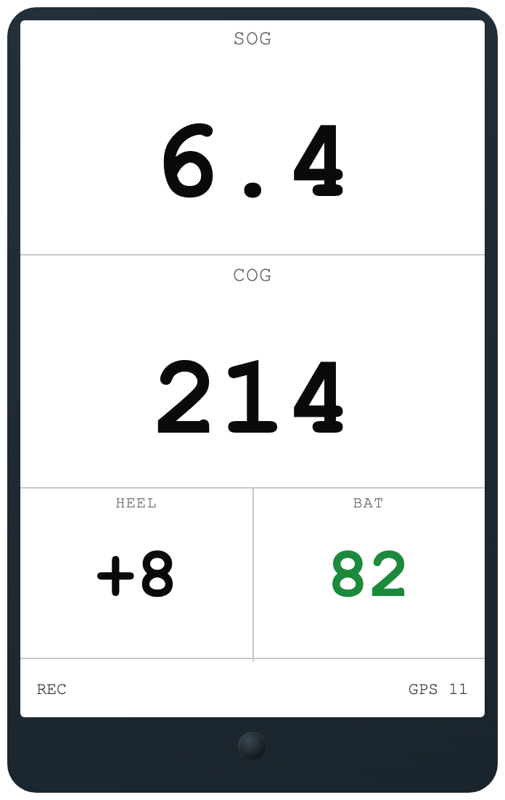
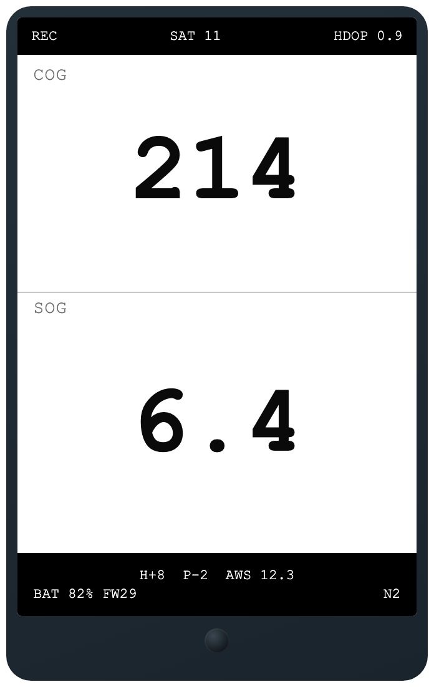
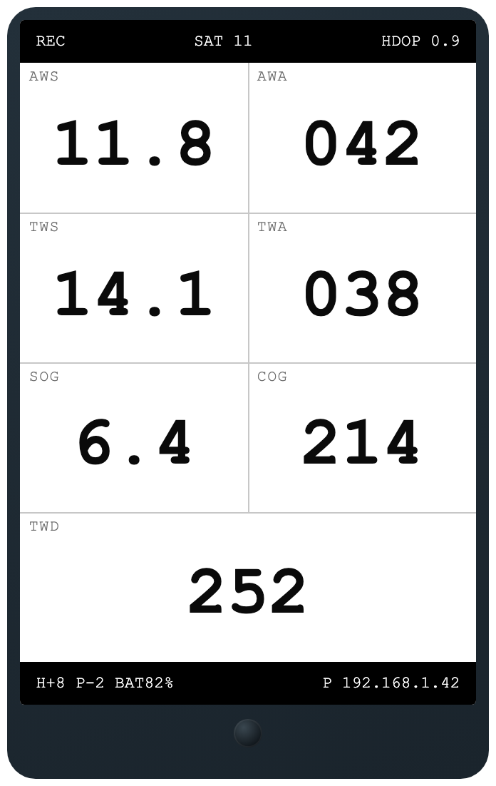
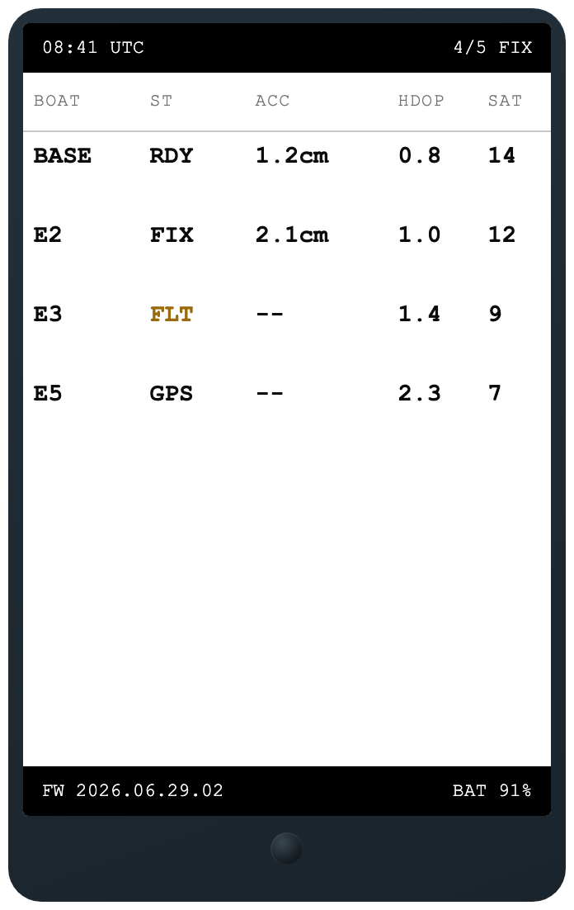
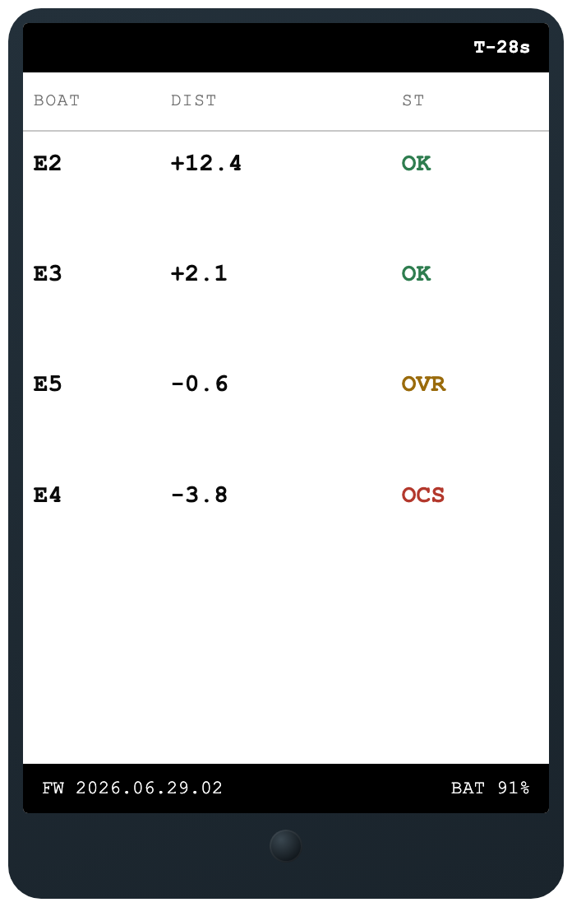
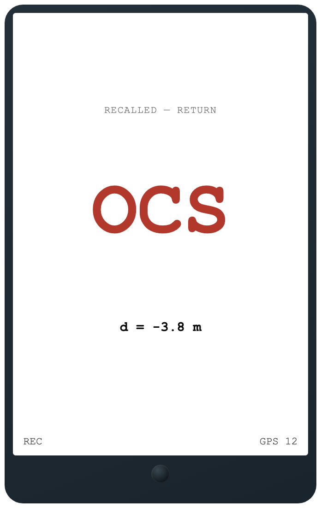

# Hardware reference

The current battery/power, display, and recording-control setup, as
implemented in `firmware/sailframes_edge/` (`config.h`, `battery.cpp`,
`display.cpp`, `recording.cpp`) and the KiCad project in `hardware/`.
Earlier hardware revisions (an OLED display, a different battery pack
and voltage divider, a momentary power button with deep-sleep) are not
described here — see "Superseded designs" at the end if you're trying to
make sense of an older E1 unit in the field.

## Power

**No software power control at all.** A hardware SPDT slide switch cuts
all power to the board directly — there's no deep sleep, no button-hold
shutdown sequence, and no GPIO involved in powering the unit off. This is
deliberate: the firmware's own header comment states the design plainly —
*"Power control: Hardware switch on boost converter. No software deep
sleep — hardware switch cuts all power when OFF."* The only thing
software does around a power-off is make sure it doesn't happen mid-write:
`updateRecordingState()`'s `REC_STOPPING` path and `handleLowBattery()`
both flush and close any open session files before anything else, so a
switch flip mid-race doesn't corrupt the CSV in progress.

### Battery monitoring

- **Divider**: 100 kΩ / 100 kΩ from the LiPo's B+ straight to GPIO34
  (`BATT_VOLTAGE_PIN`, ADC1 — input-only, no pull-up, avoids ADC2's WiFi
  conflict). Nominal ratio is 2.0; the firmware uses a calibrated
  `BATT_DIVIDER_RATIO = 2.25` (`battery.cpp`) to correct for the ESP32
  ADC's non-linearity (empirically: a multimeter-measured 4.165 V read as
  3.70 V through the raw divider math, so `4.165 / 3.70 * 2.0 = 2.25`).
  16 averaged samples per read (`BATT_SAMPLES`) smooth out ADC noise.
- **Percent estimate**: a piecewise-linear lookup table over the LiPo
  discharge curve (`getBatteryPercent()`), not a straight voltage-to-percent
  line — the curve is genuinely non-linear (steep at both ends, flat in
  the middle), so a linear mapping over- or under-reports charge in the
  middle of the range:

  | Voltage | 4.20 | 4.15 | 4.10 | 4.05 | 4.00 | 3.90 | 3.80 | 3.70 | 3.60 | 3.50 | 3.40 | 3.30 |
  |---|---|---|---|---|---|---|---|---|---|---|---|---|
  | Percent | 100 | 95 | 85 | 75 | 65 | 50 | 35 | 20 | 12 | 6 | 2 | 0 |

- **Critical/low-battery behavior**: `isBatteryCritical()` fires below
  3.3 V (and only when the reading is plausible — above 0.5 V — so an
  unconnected/faulty sense line doesn't false-trigger). `handleLowBattery()`
  then flushes and closes any open session files, paints a red "LOW
  BATTERY / Flip power switch to OFF" screen, and halts in a `delay(1000)`
  loop — recovery is the operator flipping the hardware switch, not an
  automatic power-off, since there's no software path to cut power.

### Button-triggered recording

Recording start/stop is manual, not GPS-speed-triggered: a short press of
the physical button (`button.cpp`, `BUTTON_PIN` below) toggles
`recording.h`'s `startRecording()`/`stopRecording()` — same entry point
as the console's `rec`/`stoprec` commands and the BLE relay's `control`
`start-rec`/`stop-rec` commands (`docs/ble-config.md`). There is no
auto-start and no auto-stop on speed; a session runs until the operator
explicitly stops it (button, console, or app) or powers off (the slide
switch, which flushes and closes any open session files first — see
"Power" above). `config.start_speed_knots` survives only as the
"boat is moving" heuristic `upload.cpp` uses to abort an in-progress
upload cycle, not as a recording trigger — see
`docs/firmware-architecture.md` for the OCS/mesh context this recording
state feeds into, and `firmware/README.md` for the resulting log files.

### Recording/pairing button

A momentary pushbutton, active-low: one leg to `BUTTON_PIN` (GPIO32),
the other to GND, using the ESP32's internal pull-up (no external
resistor). `button.cpp` debounces it (`BUTTON_DEBOUNCE_MS`, 30 ms) and
dispatches two gestures:

- **Short press** — toggles recording (above).
- **Long press** (held past `BUTTON_LONG_PRESS_MS`, 2 s) — opens a
  60-second BLE pairing window (`BLE_BOND_WINDOW_MS`,
  `ble_relay.cpp`'s `bleOpenBondWindow()`) during which a new phone can
  complete its first bond; outside the window, a not-yet-bonded
  connection can't write the characteristics that carry secrets
  (`device_api_key`, WiFi password). See `docs/ble-config.md` for the
  full pairing-window spec. This requires physical presence at the boat
  to pair a new phone, rather than anyone in BLE range being able to.

## Display

**Hosyond 3.5" IPS ST7796U TFT, 480×320, SPI** (`TFT_eSPI`, configured via
`firmware/sailframes_edge/User_Setup.h`). Portrait orientation
(`tft.setRotation(2)`), inverted colors (`tft.invertDisplay(true)` — this
specific panel needs it for correct colors), PWM-dimmable backlight on
GPIO25 (`TFT_BL_PIN`) — full brightness while recording
(`TFT_BL_DUTY_RECORDING`, ~80%) and dimmed otherwise
(`TFT_BL_DUTY_IDLE`, ~50%) to save power, since the backlight is the
single largest current draw in the system.

The TFT and the microSD card are on **separate SPI buses** — the display
on the default VSPI bus, the SD card on HSPI with its own explicit pins
(`SD_CS_PIN`/`SD_CLK_PIN`/`SD_MISO_PIN`/`SD_MOSI_PIN` in `config.h`).
This is deliberate, not incidental: sharing one bus between the two
caused visible display flicker during SD writes on an earlier board
revision.

Three nav display modes exist (`display.cpp`'s `updateDisplayD1/D2/D3`,
cycled with the `display` console command, or set persistently via
`device_config`'s `display_mode` field over BLE — see `docs/ble-config.md`),
plus two RC-only panels (`drawRcFleetPanel`/`drawRcPreRacePanel`) that take
over the screen in place of the nav display while the unit's role is
`rc_signal` — see `docs/firmware-architecture.md` for what those panels
show and why.

The renders below are pixel-accurate reconstructions of `display.cpp`'s
layout (coordinates, dividers, colors) with sample data standing in for
live sensor readings — not photos of a running board.

**D1 — simple**
 
 SOG/COG at full size, heel + battery below. Built for sunlight
readability, nothing else on screen.

**D2 — nav + wind (default)**
 
 COG over SOG, status bar with fix/sat/HDOP, bottom bar with
heel/pitch/wind/battery/upload — plus signed distance-to-line
(`L+5.2m`) once a race is armed.

**D3 — wind focus**
 
 4×2 grid: apparent + true wind (speed/angle), SOG/COG, true wind
direction full-width at the bottom.

**RC pre-race panel**
 
 `rc_signal`-only: one row per connected peer — fix quality, accuracy,
HDOP, sat count — with a fleet-readiness "N/M FIX" gauge up top.

**RC in-race panel**
 
 Live signed distance-to-line and OCS state per boat (OK / OVR / OCS),
start countdown top-right.

**Boat-side OCS alarm**
 
 Takes over the nav display when the RC recalls this boat — the RC's
call is authoritative regardless of the boat's own local computation.

## Superseded designs (for context only — not what's on the board today)

Earlier E1 hardware revisions used a 2.42" SSD1309 OLED (128×64,
monochrome) instead of the TFT — replaced because it was unreadable
through polarized sunglasses and too small for a multi-value dashboard —
and a different battery/divider combination (first a PowerBoost-style
boost converter with a 200Ω/200Ω divider drawing a continuous ~10 mA,
later corrected to the 100 kΩ/100 kΩ divider described above once the
continuous drain was recognized as wasteful). An even earlier revision
used a momentary pushbutton (ESP32 deep sleep, wake-on-button) rather
than the hardware slide switch — none of this is present in the current
firmware or the KiCad project in `hardware/`; it's noted here only so a
differently-wired older unit doesn't look like a bug.
